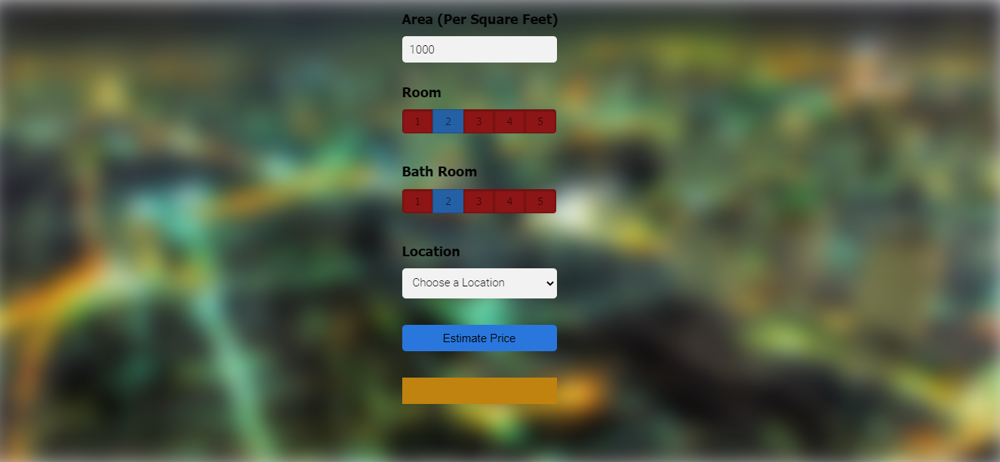

# dhaka_flat_price_prediction



This is s complete Full-Stack Data Science Project which is  a Dhaka City Flat's Price Prediction website. At first I, build a model using sklearn and linear regression using Dhaka City Flat's Prices dataset. Second step I write a python flask server that uses the saved model to serve http requests. Third component is the website built in html, css and javascript that allows user to enter home square ft area, bedrooms etc and it will call python flask server to retrieve the predicted price. During model building I cover almost all data science concepts such as data load and cleaning, outlier detection and removal, feature engineering, dimensionality reduction, gridsearchcv for hyperparameter tunning, k fold cross validation etc. Technology and tools wise this project covers,

1. Python
2. Numpy and Pandas for data cleaning
3. Matplotlib for data visualization
4. Sklearn for model building
5. Jupyter notebook, visual studio code and pycharm as IDE
6. Python flask for http server
7. HTML/CSS/Javascript for UI

# Deploy this app to cloud (AWS EC2)

1. Create EC2 instance using amazon console, also in security group add a rule to allow HTTP incoming traffic
2. Now connect to my instance using a command like this,
```
ssh -i "C:\Users\Md Mahadi Hasan Sany\.ssh\dhaka.pem" ubuntu@ec2-54-84-32-87.compute-1.amazonaws.com
```
3. nginx setup
   1. Install nginx on EC2 instance using these commands,
   ```
   sudo apt-get update
   sudo apt-get install nginx
   ```
   2. Above will install nginx as well as run it. Check status of nginx using
   ```
   sudo service nginx status
   ```
   3. Here are the commands to start/stop/restart nginx
   ```
   sudo service nginx start
   sudo service nginx stop
   sudo service nginx restart
   ```
   4. Now when I load cloud url in browser then see a message saying "welcome to nginx" This means your nginx is setup and running.
4. Now I to copy all my code to EC2 instance. This can do this either using git or copy files using winscp. We used winscp. Download winscp from here: https://winscp.net/eng/download.php
5. Once connected to EC2 instance from winscp, I now copy all code files into /home/ubuntu/ folder. The full path of your root folder is now: **/home/ubuntu/HousePricePrediction**
6.  After copying code on EC2 server now I point nginx to load my property website by default. For below steps,
    1. Create this file /etc/nginx/sites-available/bhp.conf. The file content looks like this,
    ```
    server {
	    listen 80;
            server_name bhp;
            root /home/ubuntu/HousePricePrediction/client;
            index app.html;
            location /api/ {
                 rewrite ^/api(.*) $1 break;
                 proxy_pass http://127.0.0.1:5000;
            }
    }
    ```
    2. Create symlink for this file in /etc/nginx/sites-enabled by running this command,
    ```
    sudo ln -v -s /etc/nginx/sites-available/dhp.conf
    ```
    3. Remove symlink for default file in /etc/nginx/sites-enabled directory,
    ```
    sudo unlink default
    ```
    4. Restart nginx,
    ```
    sudo service nginx restart
    ```
7. Now install python packages and start flask server
```
sudo apt-get install python3-pip
sudo pip3 install -r /home/ubuntu/BangloreHomePrices/server/requirements.txt
python3 /home/ubuntu/BangloreHomePrices/client/server.py
```
Running last command above will prompt that server is running on port 5000.
8. Now, I just load my cloud url in browser (for me it was http://ec2-54-84-32-87.compute-1.amazonaws.com/) and this will be fully functional website running in production cloud environment


